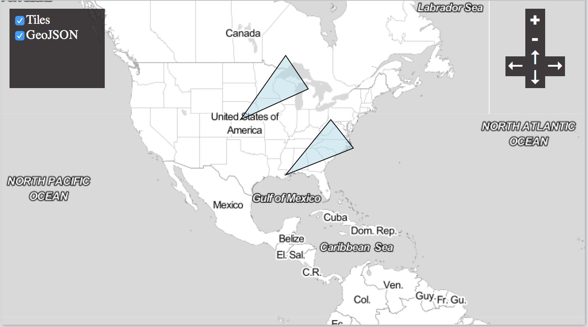

geojsonio
========

```{r echo=FALSE}
knitr::opts_chunk$set(
  comment = "#>",
  collapse = TRUE,
  warning = FALSE,
  message = FALSE,
  fig.width = 10,
  fig.path = "inst/img/"
)
```

[](https://travis-ci.org/ropensci/geojsonio)
[](https://coveralls.io/r/ropensci/geojsonio)

__Convert various data formats to geoJSON or topoJSON__

This package is a utility to convert geographic data to geojson and topojson formats. Nothing else. We hope to do this one job very well, and handle all reasonable use cases.

Functions in this package are organized first around what you're working with or want to get, geojson or topojson, then convert to or read from various formats:

* `geojson_list()`/`topojson_list()` - convert to geojson/topojson as R list format
* `geojson_json()`/`topojson_json()` - convert to geojson/topojson as json
* `geojson_read()``topojson_read()` - read a geojson/topojson file from file path or URL
* `geojson_write()` - write a geojson file locally (topojson coming later)

Each of the above functions have methods for various objects/classes, including `numeric`, `data.frame`, `list`, `SpatialPolygons`, `SpatialLines`, `SpatialPoints`, etc.

Additional functions:

* `map_gist()` - push up a geojson or topojson file as a GitHub gist (renders as an interactive map)

## *json Info

* GeoJSON - [spec](http://geojson.org/geojson-spec.html)
* [GeoJSON lint](http://geojsonlint.com/)
* TopoJSON - [spec](https://github.com/topojson/topojson-specification/blob/master/README.md)
* TopoJSON node library - [on NMP](https://www.npmjs.org/package/topojson), [source](https://github.com/mbostock/topojson)

## Quick start

### Install

Install rgdal - in case you can't get it installed from binary , here's what works on a Mac (change to the version of `rgdal` and `GDAL` you have).

```{r eval=FALSE}
install.packages("http://cran.r-project.org/src/contrib/rgdal_0.9-1.tar.gz", repos = NULL, type="source", configure.args = "--with-gdal-config=/Library/Frameworks/GDAL.framework/Versions/1.10/unix/bin/gdal-config --with-proj-include=/Library/Frameworks/PROJ.framework/unix/include --with-proj-lib=/Library/Frameworks/PROJ.framework/unix/lib")
```

Install `geojsonio`

```{r eval=FALSE}
install.packages("devtools")
devtools::install_github("ropensci/geojsonio")
```

```{r}
library("geojsonio")
```

### GeoJSON

#### Convert various formats to geojson

From a `numeric` vector of length 2, as json or list

```{r}
geojson_json(c(32.45,-99.74))
geojson_list(c(32.45,-99.74))
```

From a `data.frame`

```{r}
library('maps')
data(us.cities)
geojson_json(us.cities[1:2,], lat='lat', lon='long')
geojson_list(us.cities[1:2,], lat='lat', lon='long')
```

From `SpatialPolygons` class

```{r}
library('sp')
poly1 <- Polygons(list(Polygon(cbind(c(-100,-90,-85,-100),
  c(40,50,45,40)))), "1")
poly2 <- Polygons(list(Polygon(cbind(c(-90,-80,-75,-90),
  c(30,40,35,30)))), "2")
sp_poly <- SpatialPolygons(list(poly1, poly2), 1:2)
```

to json

```{r}
geojson_json(sp_poly)
```

to list

```{r}
geojson_list(sp_poly)$features[[1]]
```

#### Write geojson

```{r}
library('maps')
data(us.cities)
geojson_write(us.cities[1:2,], lat='lat', lon='long')
```

#### Read geojson

```{r}
file <- system.file("examples", "california.geojson", package = "geojsonio")
out <- geojson_read(file)
```

### TopoJSON

#### Read topojson

TopoJSON

```{r}
url <- "https://raw.githubusercontent.com/shawnbot/d3-cartogram/master/data/us-states.topojson"
out <- topojson_read(url)
plot(out)
```

### Use case: Make a map

```{r eval=FALSE}
library('sp')
library('cartographer')
poly1 <- Polygons(list(Polygon(cbind(c(-100,-90,-85,-100),
   c(40,50,45,40)))), "1")
poly2 <- Polygons(list(Polygon(cbind(c(-90,-80,-75,-90),
   c(30,40,35,30)))), "2")
sp_poly <- SpatialPolygons(list(poly1, poly2), 1:2)
cartographer() %>%
 tile_layer() %>%
 geojson_layer(data = geojson_json(sp_poly))
```



## Meta

* [Please report any issues or bugs](https://github.com/ropensci/geojsonio/issues).
* License: MIT
* Get citation information for `geojsonio` in R doing `citation(package = 'geojsonio')`

[](http://ropensci.org)
