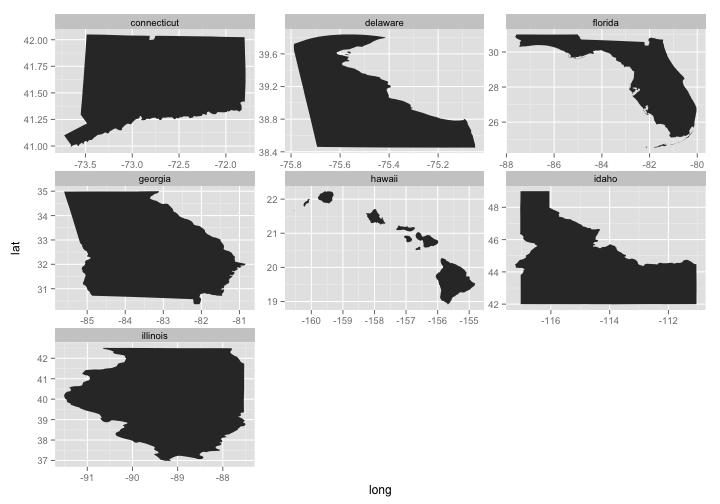

geojsonio
========


[](https://travis-ci.org/ropensci/geojsonio)

__Convert various data formats to geoJSON or topoJSON__

This package is a utility to convert geographic data to geojson and topojson formats. Nothing else. We hope to do this one job very well, and handle all reasonable use cases.

Functions in this package are organized first around what you're working with or want to get, geojson or topojson, then convert to or read from various formats:

* `geojson_list()`/`topojson_list()` - convert to geojson/topojson as R list format
* `geojson_json()`/`topojson_json()` - convert to geojson/topojson as json
* `geojson_read()``topojson_read()` - read a geojson/topojson file from file path or URL
* `geojson_write()`/`topojson_write()` - write a geojson/topojson file locally

Each of the above functions have methods for various objects/classes, including `numeric`, `data.frame`, `list`, `SpatialPolygons`, `SpatialLines`, `SpatialPoints`, etc.

Additional functions:

* `map_gist()` - push up a geojson or topojson file as a GitHub gist (renders as an interactive map)

## *json Info

* GeoJSON - [spec](http://geojson.org/geojson-spec.html)
* [GeoJSON lint](http://geojsonlint.com/)
* TopoJSON - [spec](https://github.com/topojson/topojson-specification/blob/master/README.md)
* TopoJSON node library - [on NMP](https://www.npmjs.org/package/topojson), [source](https://github.com/mbostock/topojson)

## Quick start

### Install

Install rgdal - in case you can't get it installed from binary , here's what works on a Mac.


```r
install.packages("http://cran.r-project.org/src/contrib/rgdal_0.9-1.tar.gz", repos = NULL, type="source", configure.args = "--with-gdal-config=/Library/Frameworks/GDAL.framework/Versions/1.10/unix/bin/gdal-config --with-proj-include=/Library/Frameworks/PROJ.framework/unix/include --with-proj-lib=/Library/Frameworks/PROJ.framework/unix/lib")
```

Install `geojsonio`


```r
install.packages("devtools")
devtools::install_github("ropensci/geojsonio")
```


```r
library("geojsonio")
```


### GeoJSON

#### Convert various formats to geojson

From a `numeric` vector of length 2, as json or list


```r
geojson_json(c(32.45,-99.74))
#> {"type":"Point","geometry":{"type":"Point","coordinates":[32.45,-99.74]},"properties":{}}
geojson_list(c(32.45,-99.74))
#> $type
#> [1] "Point"
#> 
#> $geometry
#> $geometry$type
#> [1] "Point"
#> 
#> $geometry$coordinates
#> [1]  32.45 -99.74
#> 
#> 
#> $properties
#> NULL
#> 
#> attr(,"class")
#> [1] "geo_list"
#> attr(,"from")
#> [1] "numeric"
```

From a `data.frame`


```r
library('maps')
data(us.cities)
geojson_json(us.cities[1:2,], lat='lat', lon='long')
#> {"type":"FeatureCollection","features":[{"type":"Feature","geometry":{"type":"Point","coordinates":[-99.74,32.45]},"properties":{"name":"Abilene TX","country.etc":"TX","pop":"113888","capital":"0"}},{"type":"Feature","geometry":{"type":"Point","coordinates":[-81.52,41.08]},"properties":{"name":"Akron OH","country.etc":"OH","pop":"206634","capital":"0"}}]}
geojson_list(us.cities[1:2,], lat='lat', lon='long')
#> $type
#> [1] "FeatureCollection"
#> 
#> $features
#> $features[[1]]
#> $features[[1]]$type
#> [1] "Feature"
#> 
#> $features[[1]]$geometry
#> $features[[1]]$geometry$type
#> [1] "Point"
#> 
#> $features[[1]]$geometry$coordinates
#> [1] -99.74  32.45
#> 
#> 
#> $features[[1]]$properties
#> $features[[1]]$properties$name
#> [1] "Abilene TX"
#> 
#> $features[[1]]$properties$country.etc
#> [1] "TX"
#> 
#> $features[[1]]$properties$pop
#> [1] "113888"
#> 
#> $features[[1]]$properties$capital
#> [1] "0"
#> 
#> 
#> 
#> $features[[2]]
#> $features[[2]]$type
#> [1] "Feature"
#> 
#> $features[[2]]$geometry
#> $features[[2]]$geometry$type
#> [1] "Point"
#> 
#> $features[[2]]$geometry$coordinates
#> [1] -81.52  41.08
#> 
#> 
#> $features[[2]]$properties
#> $features[[2]]$properties$name
#> [1] "Akron OH"
#> 
#> $features[[2]]$properties$country.etc
#> [1] "OH"
#> 
#> $features[[2]]$properties$pop
#> [1] "206634"
#> 
#> $features[[2]]$properties$capital
#> [1] "0"
#> 
#> 
#> 
#> 
#> attr(,"class")
#> [1] "geo_list"
#> attr(,"from")
#> [1] "data.frame"
```

From `SpatialPolygons` class


```r
library('sp')
poly1 <- Polygons(list(Polygon(cbind(c(-100,-90,-85,-100),
  c(40,50,45,40)))), "1")
poly2 <- Polygons(list(Polygon(cbind(c(-90,-80,-75,-90),
  c(30,40,35,30)))), "2")
sp_poly <- SpatialPolygons(list(poly1, poly2), 1:2)
```

to json


```r
geojson_json(sp_poly)
#> {"type":"FeatureCollection","features":[{"type":"Feature","id":1,"properties":{"dummy":0},"geometry":{"type":"Polygon","coordinates":[[[-100,40],[-90,50],[-85,45],[-100,40]]]}},{"type":"Feature","id":2,"properties":{"dummy":0},"geometry":{"type":"Polygon","coordinates":[[[-90,30],[-80,40],[-75,35],[-90,30]]]}}]}
```

to list


```r
geojson_list(sp_poly)$coordinates[[1]]
#> NULL
```

#### Write geojson


```r
library('maps')
data(us.cities)
geojson_write(us.cities[1:2,], lat='lat', lon='long')
#> [1] "myfile.geojson"
```

#### Read geojson


```r
file <- system.file("examples", "california.geojson", package = "geojsonio")
out <- geojson_read(file)
#> OGR data source with driver: GeoJSON 
#> Source: "/Users/sacmac/Library/R/3.1/library/geojsonio/examples/california.geojson", layer: "OGRGeoJSON"
#> with 1 features and 11 fields
#> Feature type: wkbMultiPolygon with 2 dimensions
plot(out)
```

 

### TopoJSON

#### Convert to TopoJSON with Node topojson client

For topojson you will need Mike Bostock's command line client. Install it by doing

```
sudo npm install -g topojson
```

Download a zipped shape fileset, [this one](http://esp.cr.usgs.gov/data/little/querwisl.zip) for distribution of _Quercus wislizeni_. Unzip the zip file to a folder. Then do (changing the path to your path)


```r
topojson_write(shppath='~/Downloads/querwisl', path = "~/Downloads", projection='albers', projargs=list(rotate='[60, -35, 0]'))
#> Error in ogrListLayers(fullpathtoshp): Cannot open data source
```

Which prints progress on the conversion of the shape file. And prints the topojson CLI call, including the location of the output file, here `/Users/sacmac/querwisl.json`


```r
OGR data source with driver: ESRI Shapefile
Source: "/Users/sacmac/Downloads/querwisl", layer: "querwisl"
with 35 features and 5 fields
Feature type: wkbPolygon with 2 dimensions
topojson -o /Users/sacmac/querwisl.json -q 1e4 -s 0 --shapefile-encoding utf8 --projection 'd3.geo.albers().rotate([60, -35, 0])' -- /var/folders/gs/4khph0xs0436gmd2gdnwsg080000gn/T//Rtmp49APW7/querwisl.shp

bounds: -403.2554825867553 401.27189387582916 -295.798050380061 585.4214768677039 (cartesian)
pre-quantization: 0.010746817902459677 0.018416799979185387
topology: 35 arcs, 2492 points
prune: retained 35 / 35 arcs (100%)
```

You can then use this topojson file wherever. We'll add a function soon to automagically throw this file up as a Github gist to get an interactive map.

#### Read topojson

TopoJSON


```r
url <- "https://raw.githubusercontent.com/shawnbot/d3-cartogram/master/data/us-states.topojson"
out <- topojson_read(url)
#> OGR data source with driver: GeoJSON 
#> Source: "https://raw.githubusercontent.com/shawnbot/d3-cartogram/master/data/us-states.topojson", layer: "states"
#> with 51 features and 2 fields
#> Feature type: wkbPolygon with 2 dimensions
plot(out)
```

 

### Use case: Play with US states

Using data from [https://github.com/glynnbird/usstatesgeojson](https://github.com/glynnbird/usstatesgeojson)

Get some geojson


```r
library('httr')
res <- GET('https://api.github.com/repos/glynnbird/usstatesgeojson/contents')
st_names <- Filter(function(x) grepl("\\.geojson", x), sapply(content(res), "[[", "name"))
base <- 'https://raw.githubusercontent.com/glynnbird/usstatesgeojson/master/'
st_files <- paste0(base, st_names)
```

Make a faceted plot


```r
library('ggplot2')
library('plyr')
st_use <- st_files[7:13]
geo <- lapply(st_use, geojson_read, verbose = FALSE)
df <- ldply(setNames(lapply(geo, fortify), gsub("\\.geojson", "", st_names[7:13])))
ggplot(df, aes(long, lat, group = group)) +
  geom_polygon() +
  facet_wrap(~ .id, scales = "free")
```

 

## Meta

* [Please report any issues or bugs](https://github.com/ropensci/geojsonio/issues).
* License: MIT
* Get citation information for `geojsonio` in R doing `citation(package = 'geojsonio')`

[](http://ropensci.org)
