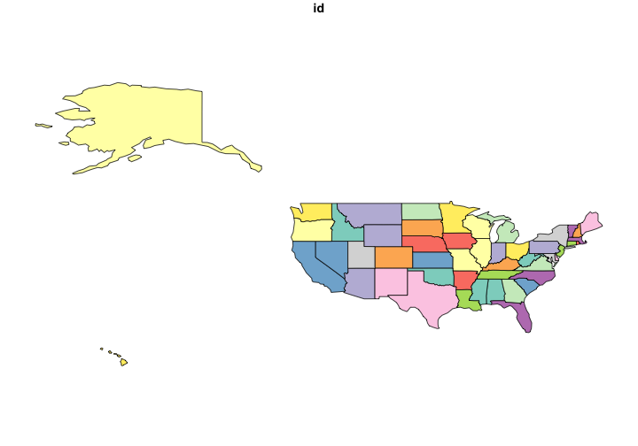
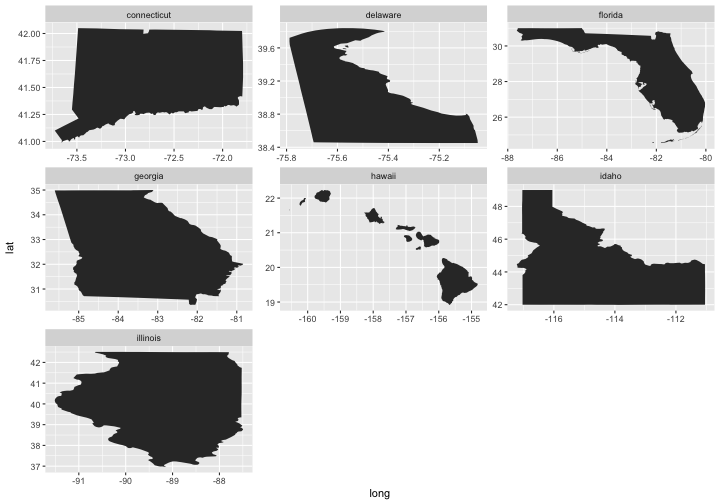

geojsonio
=========


[](https://cranchecks.info/pkgs/geojsonio)
[](https://travis-ci.org/ropensci/geojsonio)
[](https://github.com/ropensci/geojsonio)
[](https://codecov.io/github/ropensci/geojsonio?branch=master)
[](https://github.com/metacran/cranlogs.app)
[](https://cran.r-project.org/package=geojsonio)

__Convert various data formats to GeoJSON or TopoJSON__

This package is a utility to convert geographic data to GeoJSON and TopoJSON formats. Nothing else. We hope to do this one job very well, and handle all reasonable use cases.

Functions in this package are organized first around what you're working with or want to get, GeoJSON or TopoJSON, then convert to or read from various formats:

* `geojson_list()`/`topojson_list()` - convert to GeoJSON/TopoJSON as R list format
* `geojson_json()`/`topojson_json()` - convert to GeoJSON/TopoJSON as JSON
* `geojson_sp()` - convert output of `geojson_list()` or `geojson_json()` to `sp` spatial objects
* `geojson_sf()` - convert output of `geojson_list()` or `geojson_json()` to `sf` objects
* `geojson_read()`/`topojson_read()` - read a GeoJSON/TopoJSON file from file path or URL
* `geojson_write()`/`topojson_write()` - write a GeoJSON/TopoJSON file locally

Each of the above functions have methods for various objects/classes, including `numeric`, `data.frame`, `list`, `SpatialPolygons`, `SpatialLines`, `SpatialPoints`, etc.

Additional functions:

* `map_gist()` - push up a GeoJSON or topojson file as a GitHub gist (renders as an interactive map)
* `map_leaf()` - create a local interactive map using the `leaflet` package

## \*json Info

* GeoJSON - [spec](https://tools.ietf.org/html/rfc7946)
* [GeoJSON lint](http://geojsonlint.com/)
* TopoJSON - [spec](https://github.com/topojson/topojson-specification/blob/master/README.md)


## Install

A note about installing `rgeos` - built on top of C libraries, and installation often causes trouble for Linux users because no binaries are provided on CRAN for those platforms. Other dependencies in `geojsonio` should install easily automatically when you install `geojsonio`.

_Mac_

Install `GDAL` on the command line first, e.g., using `homebrew`

```
brew install gdal
```

Then install `rgeos`


```r
install.packages("rgeos", type = "source")
```

_Linux_

Get deps first

```
sudo apt-get install libgdal1-dev libgdal-dev libgeos-c1 libproj-dev
```

> Note: if you have trouble installing rgeos, try installing `libgeos++-dev`

Then install `rgeos`


```r
install.packages("rgeos", type = "source")
```

__Install geojsonio__

Stable version from CRAN


```r
install.packages("geojsonio")
```

Or development version from GitHub


```r
install.packages("devtools")
devtools::install_github("ropensci/geojsonio")
```


```r
library("geojsonio")
```

## GeoJSON

### Convert various formats to GeoJSON

From a `numeric` vector of length 2, as json or list


```r
geojson_json(c(32.45, -99.74))
#> <FeatureCollection> 
#>   type:  FeatureCollection 
#>   no. features:  1 
#>   features (1st 5):  Point
```


```r
geojson_list(c(32.45, -99.74))
#> $type
#> [1] "FeatureCollection"
#> 
#> $features
#> $features[[1]]
#> $features[[1]]$type
#> [1] "Feature"
#> 
#> $features[[1]]$geometry
#> $features[[1]]$geometry$type
...
```

From a `data.frame`


```r
library('maps')
data(us.cities)
geojson_json(us.cities[1:2, ], lat = 'lat', lon = 'long')
#> <FeatureCollection> 
#>   type:  FeatureCollection 
#>   no. features:  2 
#>   features (1st 5):  Point, Point
```


```r
geojson_list(us.cities[1:2, ], lat = 'lat', lon = 'long')
#> $type
#> [1] "FeatureCollection"
#> 
#> $features
#> $features[[1]]
#> $features[[1]]$type
#> [1] "Feature"
#> 
#> $features[[1]]$geometry
#> $features[[1]]$geometry$type
...
```

From `SpatialPolygons` class


```r
library('sp')
poly1 <- Polygons(list(Polygon(cbind(c(-100, -90, -85, -100),
  c(40, 50, 45, 40)))), "1")
poly2 <- Polygons(list(Polygon(cbind(c(-90, -80, -75, -90),
  c(30, 40, 35, 30)))), "2")
sp_poly <- SpatialPolygons(list(poly1, poly2), 1:2)
```

to json


```r
geojson_json(sp_poly)
#> <FeatureCollection> 
#>   type:  FeatureCollection 
#>   no. features:  2 
#>   features (1st 5):  Polygon, Polygon
```

to list


```r
geojson_list(sp_poly)$features[[1]]
#> $type
#> [1] "Feature"
#> 
#> $id
#> [1] 1
#> 
#> $properties
#> $properties$dummy
#> [1] 0
#> 
...
```

### Combine objects

`geo_list` + `geo_list`

> Note: `geo_list` is the output type from `geojson_list()`, it's just a list with a class attached so we know it's geojson :)


```r
vec <- c(-99.74, 32.45)
a <- geojson_list(vec)
vecs <- list(c(100.0, 0.0), c(101.0, 0.0), c(100.0, 0.0))
b <- geojson_list(vecs, geometry = "polygon")
a + b
#> $type
#> [1] "FeatureCollection"
#> 
#> $features
#> $features[[1]]
#> $features[[1]]$type
#> [1] "Feature"
#> 
#> $features[[1]]$geometry
#> $features[[1]]$geometry$type
...
```

`json` + `json`


```r
c <- geojson_json(c(-99.74, 32.45))
vecs <- list(c(100.0, 0.0), c(101.0, 0.0), c(101.0, 1.0), c(100.0, 1.0), c(100.0, 0.0))
d <- geojson_json(vecs, geometry = "polygon")
c + d
#> {"type":"FeatureCollection","features":[{"type":"Feature","geometry":{"type":"Point","coordinates":[-99.74,32.45]},"properties":{}},{"type":"Feature","geometry":{"type":"Polygon","coordinates":[[[100,0],[101,0],[101,1],[100,1],[100,0]]]},"properties":[]}]}
```

### Write GeoJSON


```r
library('maps')
data(us.cities)
geojson_write(us.cities[1:2, ], lat = 'lat', lon = 'long')
#> <geojson-file>
#>   Path:       myfile.geojson
#>   From class: data.frame
```

### Read GeoJSON


```r
file <- system.file("examples", "california.geojson", package = "geojsonio")
out <- geojson_read(file)
names(out)
#> [1] "type"     "name"     "crs"      "features"
names(out$features[[1]])
#> [1] "type"       "properties" "geometry"
```

## TopoJSON

### to JSON


```r
topojson_json(c(-99.74,32.45))
#> {"type":"Topology","objects":{"foo":{"type":"GeometryCollection","geometries":[{"type":"Point","coordinates":[-99.74,32.45]}]}},"arcs":[],"bbox":[-99.74,32.45,-99.74,32.45]}
```

### to list


```r
library(sp)
x <- c(1,2,3,4,5)
y <- c(3,2,5,1,4)
s <- SpatialPoints(cbind(x,y))
topojson_list(s)
#> $type
#> [1] "Topology"
#> 
#> $objects
#> $objects$foo
#> $objects$foo$type
#> [1] "GeometryCollection"
#> 
#> $objects$foo$geometries
#> $objects$foo$geometries[[1]]
#> $objects$foo$geometries[[1]]$type
#> [1] "Point"
#> 
#> $objects$foo$geometries[[1]]$coordinates
#> [1] 1 3
#> 
#> $objects$foo$geometries[[1]]$id
#> [1] 1
#> 
#> $objects$foo$geometries[[1]]$properties
...
```

### Write TopoJSON


```r
library('maps')
data(us.cities)
topojson_write(us.cities[1:2, ], lat = 'lat', lon = 'long')
#> <topojson-file>
#>   Path:       myfile.topojson
#>   From class: data.frame
```


### Read TopoJSON


```r
file <- system.file("examples", "us_states.topojson", package = "geojsonio")
out <- topojson_read(file)
#> Reading layer `states' from data source `/Library/Frameworks/R.framework/Versions/3.6/Resources/library/geojsonio/examples/us_states.topojson' using driver `TopoJSON'
#> Simple feature collection with 51 features and 1 field
#> geometry type:  MULTIPOLYGON
#> dimension:      XY
#> bbox:           xmin: -171.7911 ymin: 18.91619 xmax: -66.96466 ymax: 71.35776
#> epsg (SRID):    NA
#> proj4string:    NA
plot(out)
```



## Use case: Play with US states

Using data from [https://github.com/glynnbird/usstatesgeojson](https://github.com/glynnbird/usstatesgeojson)

Get some geojson


```r
library('crul')
res <- HttpClient$new('https://api.github.com')$get('repos/glynnbird/usstatesgeojson/contents')
out <- jsonlite::fromJSON(res$parse("UTF-8"), FALSE)
st_names <- Filter(function(x) grepl("\\.geojson", x), sapply(out, "[[", "name"))
base <- 'https://raw.githubusercontent.com/glynnbird/usstatesgeojson/master/'
st_files <- paste0(base, st_names)
```

Make a faceted plot


```r
library('ggplot2')
library('plyr')
st_use <- st_files[7:13]
geo <- lapply(st_use, geojson_read, what = "sp")
df <- ldply(setNames(lapply(geo, fortify), gsub("\\.geojson", "", st_names[7:13])))
ggplot(df, aes(long, lat, group = group)) +
  geom_polygon() +
  facet_wrap(~.id, scales = "free")
```



Okay, so the maps are not quite right (stretched to fit each panel), but you get the idea.

## GeoJSON <-> TopoJSON

`geo2topo()` and `topo2geo()`


```r
x <- '{"type": "LineString", "coordinates": [ [100.0, 0.0], [101.0, 1.0] ]}'
(topo_json <- geo2topo(x))
#> {"type":"Topology","objects":{"foo":{"type":"LineString","arcs":[0]}},"arcs":[[[100,0],[101,1]]],"bbox":[100,0,101,1]}
topo2geo(topo_json)
#> <FeatureCollection> 
#>   type:  FeatureCollection 
#>   no. features:  1 
#>   features (1st 5):  LineString
```


## Meta

* Please [report any issues or bugs](https://github.com/ropensci/geojsonio/issues).
* License: MIT
* Get citation information for `geojsonio` in R doing `citation(package = 'geojsonio')`
* Please note that this project is released with a [Contributor Code of Conduct][coc].
By participating in this project you agree to abide by its terms.

[](https://ropensci.org)

[coc]: https://github.com/ropensci/geojsonio/blob/master/CODE_OF_CONDUCT.md
