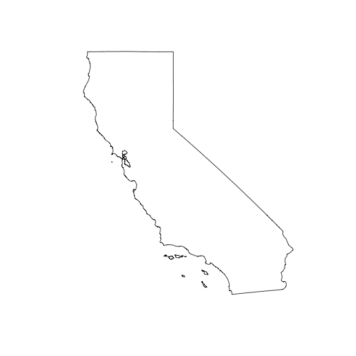

<!--
%\VignetteEngine{knitr::knitr}
%\VignetteIndexEntry{geojsonio vignette}
%\VignetteEncoding{UTF-8}
-->


geojsonio vignette
==============

`geojsonio` converts geographic data to geojson and topojson formats. Nothing else. We hope to do this one job very well, and handle all reasonable use cases.

Functions in this package are organized first around what you're working with or want to get, geojson or topojson, then convert to or read from various formats:

* `geojson_list()`/`topojson_list()` - convert to GeoJSON/TopoJSON as R list format
* `geojson_json()`/`topojson_json()` - convert to GeoJSON/TopoJSON as JSON
* `geojson_sp()` - convert output of `geojson_list()` or `geojson_json()` to spatial objects
* `geojson_read()`/`topojson_read()` - read a GeoJSON/TopoJSON file from file path or URL
* `geojson_write()`/`topojson_write()` - write a GeoJSON/TopoJSON file locally


Each of the above functions have methods for various objects/classes, including `numeric`, `data.frame`, `list`, `SpatialPolygons`, `SpatialLines`, `SpatialPoints`, etc.

Additional functions:

* `map_gist()` - push up a geojson or topojson file as a GitHub gist (renders as an interactive map) - See the _maps with geojsonio_ vignette.
* `map_leaf()` - create a local interactive map with the `leaflet` package - See the _maps with geojsonio_ vignette.

## Install

Install rgdal - in case you can't get it installed from binary , here's what works on a Mac (change to the version of `rgdal` and `GDAL` you have).


```r
install.packages("http://cran.r-project.org/src/contrib/rgdal_1.1-3.tar.gz", repos = NULL, type="source", configure.args = "--with-gdal-config=/Library/Frameworks/GDAL.framework/Versions/1.11/unix/bin/gdal-config --with-proj-include=/Library/Frameworks/PROJ.framework/unix/include --with-proj-lib=/Library/Frameworks/PROJ.framework/unix/lib")
```

Stable version from CRAN


```r
install.packages("geojsonio")
```

Development version from GitHub


```r
devtools::install_github("ropensci/geojsonio")
```


```r
library("geojsonio")
```

## GeoJSON

### Convert various formats to geojson

From a `numeric` vector of length 2

as _json_


```r
geojson_json(c(32.45, -99.74))
#> <FeatureCollection> 
#>   type:  FeatureCollection 
#>   no. features:  1 
#>   features (1st 5):  Point
```

as a __list__


```r
geojson_list(c(32.45, -99.74))
#> $type
#> [1] "FeatureCollection"
#> 
#> $features
#> $features[[1]]
#> $features[[1]]$type
#> [1] "Feature"
#> 
#> $features[[1]]$geometry
#> $features[[1]]$geometry$type
...
```

From a `data.frame`

as __json__


```r
library('maps')
data(us.cities)
geojson_json(us.cities[1:2, ], lat = 'lat', lon = 'long')
#> <FeatureCollection> 
#>   type:  FeatureCollection 
#>   no. features:  2 
#>   features (1st 5):  Point, Point
```

as a __list__


```r
geojson_list(us.cities[1:2, ], lat = 'lat', lon = 'long')
#> $type
#> [1] "FeatureCollection"
#> 
#> $features
#> $features[[1]]
#> $features[[1]]$type
#> [1] "Feature"
#> 
#> $features[[1]]$geometry
#> $features[[1]]$geometry$type
...
```

From `SpatialPolygons` class


```r
library('sp')
poly1 <- Polygons(list(Polygon(cbind(c(-100,-90,-85,-100),
  c(40,50,45,40)))), "1")
poly2 <- Polygons(list(Polygon(cbind(c(-90,-80,-75,-90),
  c(30,40,35,30)))), "2")
sp_poly <- SpatialPolygons(list(poly1, poly2), 1:2)
```

to __json__


```r
geojson_json(sp_poly)
#> <FeatureCollection> 
#>   type:  FeatureCollection 
#>   no. features:  2 
#>   features (1st 5):  Polygon, Polygon
```

to a __list__


```r
geojson_list(sp_poly)
#> $type
#> [1] "FeatureCollection"
#> 
#> $features
#> $features[[1]]
#> $features[[1]]$type
#> [1] "Feature"
#> 
#> $features[[1]]$id
#> [1] 1
...
```

From `SpatialPoints` class


```r
x <- c(1, 2, 3, 4, 5)
y <- c(3, 2, 5, 1, 4)
s <- SpatialPoints(cbind(x, y))
```

to __json__


```r
geojson_json(s)
#> <FeatureCollection> 
#>   type:  FeatureCollection 
#>   no. features:  5 
#>   features (1st 5):  Point, Point, Point, Point, Point
```

to a __list__


```r
geojson_list(s)
#> $type
#> [1] "FeatureCollection"
#> 
#> $features
#> $features[[1]]
#> $features[[1]]$type
#> [1] "Feature"
#> 
#> $features[[1]]$id
#> [1] 1
...
```

### Write geojson


```r
library('maps')
data(us.cities)
geojson_write(us.cities[1:2, ], lat = 'lat', lon = 'long')
#> <geojson-file>
#>   Path:       myfile.geojson
#>   From class: data.frame
```

### Read geojson


```r
library("sp")
file <- system.file("examples", "california.geojson", package = "geojsonio")
out <- geojson_read(file, what = "sp")
plot(out)
```



## Topojson

To JSON


```r
topojson_json(c(-99.74,32.45))
#> {"type":"Topology","objects":{"foo":{"type":"GeometryCollection","geometries":[{"type":"Point","coordinates":[-99.74,32.45]}]}},"arcs":[],"bbox":[-99.74,32.45,-99.74,32.45]}
```

To a list


```r
library(sp)
x <- c(1,2,3,4,5)
y <- c(3,2,5,1,4)
s <- SpatialPoints(cbind(x,y))
topojson_list(s)
#> $type
#> [1] "Topology"
#> 
#> $objects
#> $objects$foo
#> $objects$foo$type
#> [1] "GeometryCollection"
#> 
#> $objects$foo$geometries
#> $objects$foo$geometries[[1]]
#> $objects$foo$geometries[[1]]$type
#> [1] "Point"
#> 
#> $objects$foo$geometries[[1]]$coordinates
#> [1] 1 3
#> 
#> $objects$foo$geometries[[1]]$id
#> [1] 1
#> 
#> $objects$foo$geometries[[1]]$properties
...
```

Read from a file


```r
file <- system.file("examples", "us_states.topojson", package = "geojsonio")
out <- topojson_read(file, verbose = FALSE)
summary(out)
#> Object of class SpatialPolygonsDataFrame
#> Coordinates:
#>          min       max
#> x -171.79111 -66.96466
#> y   18.91619  71.35776
#> Is projected: NA 
#> proj4string : [NA]
#> Data attributes:
#>           id    
#>  Alabama   : 1  
#>  Alaska    : 1  
#>  Arizona   : 1  
#>  Arkansas  : 1  
#>  California: 1  
#>  Colorado  : 1  
#>  (Other)   :45
```

Read from a URL


```r
url <- "https://raw.githubusercontent.com/shawnbot/d3-cartogram/master/data/us-states.topojson"
out <- topojson_read(url, verbose = FALSE)
```

Or use `as.location()` first


```r
(loc <- as.location(file))
#> <location> 
#>    Type:  file 
#>    Location:  /Library/Frameworks/R.framework/Versions/3.4/Resources/library/geojsonio/examples/us_states.topojson
out <- topojson_read(loc, verbose = FALSE)
```
