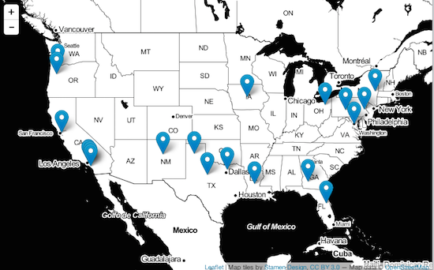
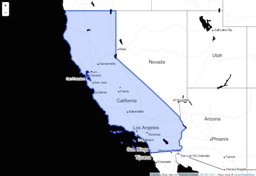
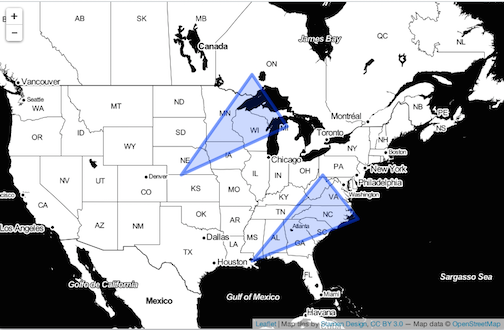
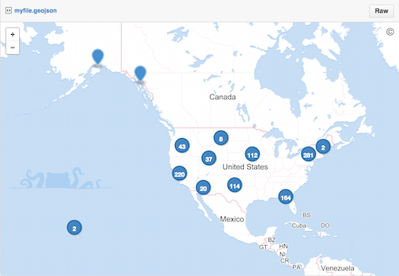

<!--
%\VignetteEngine{knitr::knitr}
%\VignetteIndexEntry{maps with geojsonio}
%\VignetteEncoding{UTF-8}
-->

```{r echo=FALSE}
knitr::opts_chunk$set(
  comment = "#>",
  collapse = TRUE,
  warning = FALSE,
  message = FALSE
)
```

maps with geojsonio
===================

`geojsonio` creates geojson from various inputs - and can easily feed into tools for making maps with geojson data.

```{r}
library("geojsonio")
```


## Mapping with leaflet

### With geojsonio::map_leaf()

#### From a file

```{r eval=FALSE}
file <- "myfile.geojson"
geojson_write(us_cities[1:20, ], lat='lat', lon='long', file = file)
map_leaf(as.location(file))
```



#### From a SpatialGridDataFrame

```{r eval=FALSE}
sgdim <- c(3, 4)
sg <- SpatialGrid(GridTopology(rep(0, 2), rep(10, 2), sgdim))
sgdf <- SpatialGridDataFrame(sg, data.frame(val = 1:12))
map_leaf(sgdf)
```


### DIY

#### Example 1: Map of California

```{r eval=FALSE}
library("leaflet")
file <- system.file("examples", "california.geojson", package = "geojsonio")
out <- as.json(geojson_read(file))
leaflet() %>% 
  addProviderTiles("Stamen.Toner") %>% 
  setView(lng = -119, lat = 37, zoom = 6) %>%
  addGeoJSON(out)
```



#### Example 2: Map of two polygons

```{r eval=FALSE}
library('sp')
poly1 <- Polygons(list(Polygon(cbind(c(-100,-90,-85,-100),
    c(40,50,45,40)))), "1")
poly2 <- Polygons(list(Polygon(cbind(c(-90,-80,-75,-90),
    c(30,40,35,30)))), "2")
sp_poly <- SpatialPolygons(list(poly1, poly2), 1:2)
json <- geojson_json(sp_poly)

leaflet() %>% 
  addProviderTiles("Stamen.Toner") %>% 
  setView(lng = -90, lat = 41, zoom = 4) %>%
  addGeoJSON(json)
```



## Mapping with GitHub gists

### `data.frame`

> Also, can do so from data.frames with polygons, lists, matrices, vectors, and json strings

```{r eval=FALSE}
map_gist(us_cities)
```



### `SpatialPoints` class

```{r eval=FALSE}
library("sp")
x <- c(1,2,3,4,5)
y <- c(3,2,5,1,4)
s <- SpatialPoints(cbind(x,y))
map_gist(s)
```


### `SpatialPixelsDataFrame` class

```{r eval=FALSE}
library("sp")
pixelsdf <- suppressWarnings(
 SpatialPixelsDataFrame(points = canada_cities[c("long", "lat")], data = canada_cities)
)
map_gist(pixelsdf)
```


> Many other spatial classes supported
